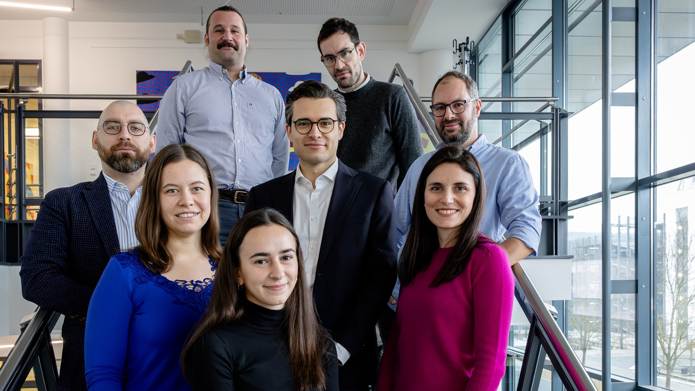

# The Grieshaber-Bouyer Laboratory

(c) SIMOarts / Simone Kessler

# About
We are a systems immunology laboratory in the [Department of Internal Medicine 3 – Rheumatology and Immunology at Erlangen University Hospital](https://www.medizin3.uk-erlangen.de/en/).  
Our group investigates the mechanisms driving immune cell heterogeneity in tissues and inflammatory conditions and the links to disease variation across individuals. Our approach is characterized by a combination of high dimensional discovery in patient samples (in particular in the context of innovative therapies such as CAR-T cells) with in vitro systems, CRISPR-mediated genetic perturbations and murine models. We also develop novel analysis tools for high dimensional data.  
In published work, we demonstrated that neutrophils in homeostasis are organized a chronologically ordered main sequence, termed neutrotime. In experimental inflammation, neutrophils reach distinct polarization states driven by timepoint, tissue and stimulus.  
To apply this principle to human immune-mediated disease, we developed a method to jointly analyze murine and human transcriptomic data. Thereby, we identified a transcriptional program which characterizes neutrophils in the arthritic joint in both mice and humans. Functionally, this program was highly enriched for interferon gamma response genes, which we validated on the protein level and using in vitro models.  

# Team

## Principal Investigator

**Prof. Dr. med. Ricardo Grieshaber-Bouyer, MHBA**  
Physician-scientist, clinical leader, and entrepreneur with a proven track record of translating breakthrough immunology into curative therapies.  

As Professor of Clinical Systems Immunology and Head of the Clinical Trial Unit, I lead a dynamic clinical and translational research team.  
My team has pioneered the first-in-patient applications of T-cell redirecting therapies for autoimmune diseases, with seminal studies published in the New England Journal of Medicine and Nature Medicine.  
I serve as a Global Principal Investigator for innovative, early-phase trials and manage a portfolio of cutting edge immunology studies focused on precision cell depletion.  
Academically, I lead a 15-member research group that works on developing new precision cell depleting therapies and understanding immunological hallmarks of therapy response and relapse.  
This research program is supported by nearly $10 million in secured PI funding.  
Bridging academia and industry, I leverage my dual background in medicine and business to drive the development of innovative therapeutics by serving on Scientific Advisory Boards and advising on preclinical benchmarking, asset acquisition and clinical strategy.  
For my impact at the intersect of clinical, scientific, and private sectors to build programs that deliver cures for autoimmunity, I was honored as [Forbes 30 Under 30](https://www.forbes.com/profile/ricardo-grieshaber-bouyer/).  

- Board Certified in Internal Medicine, Rheumatology and Immunology  
- [Professor of Clinical Systems Immunology](https://www.medizin3.uk-erlangen.de/forschung/arbeitgruppen/ag-prof-dr-r-griesshaber-bouyer/)  
- Head of the [Clinical Trial Unit](https://www.medizin3.uk-erlangen.de/en/patients/clinical-trials-unit/)  
- Director, [Center of Systems Immunology (CSI) Erlangen](https://focisnet.org/whats-new-with-focis-centers-of-excellence-fces/) [(FOCIS Center of Excellence)](https://www.focisnet.org/communities/fces/)
- Member, [FAU Profile Center for Medical Engineering](https://www.medtech.fau.eu/speakers/prof-dr-med-ricardo-grieshaber-bouyer/)
- Member, [FAU Profile Center Immunomedicine](https://www.immunology.fau.de/)

**Personal Assistant: Lisa Fischer, MSc**  
lisa.fischer@uk-erlangen.de  
+49 9131 85-39379  

## Lab Members

**Dr. Kirill Anoshkin, PhD**  
Postdoctoral fellow

**Sebastian Böltz, MD**  
Physician scientist

**Laura Bucci, MD**  
Physician scientist

**Elaine Degen**  
Dr. med. candidate

**Sonia Dresel**  
Dr. med. candidate

**Dr. Panagiotis Garantziotis, PhD**  
Physician scientist

**Ann-Kathrin Götz**  
Dr. med. candidate  
Currently a visiting scholar at the [Deepak Rao Lab](https://raolab.bwh.harvard.edu/) at the [Brigham and Women's Hospital](https://www.brighamandwomens.org/)/[Harvard Medical School](https://hms.harvard.edu/)

**Sanjukta Gubbi Praveen**  
Dr. rer. nat. candidate

**Dr. med. Melanie Hagen**  
Physician scientist  
Head of the Clinical Trial Unit

**Dr. Futoshi Iwata, MD**  
Rheumatologist  
Postdoctoral fellow

**Silke Johann**  
Research technician

**Jara Leta**  
M.Sc. student

**Nicolas J. Nitsche**  
M.Sc. student

**Dr. Zahra Moslehi, PhD**  
Postdoctoral fellow

**Danae-Mona Nöthling, MD**  
Physician scientist

**Dr. rer. nat. Tobias Rothe**  
Postdoctoral fellow

**Jana Ullmann**  
Research technician

**Dr. rer. nat. Liang Zhang, PhD**  
Postdoctoral fellow

## Alumni

**Dr. med. Cassian M. Afting**  
Rotation student  
Now [HBIGS fellow](http://www.hbigs.uni-heidelberg.de) in [Prof. Dr. Joachim Wittbrodt's Lab](https://www.cos.uni-heidelberg.de/en/research-groups/developmental-biologyphysiology)

**Selina Belghalem**  
Research technician

**Nicole Brosch**  
Research technician

**Dr. med. Tarik Exner**  
Postdoctoral fellow/PhD candidate in the [HBIGS MD/PhD program](http://www.hbigs.uni-heidelberg.de)
Now Rheumatology Fellow and Group Leader at [Heidelberg University Hospital](https://www.klinikum.uni-heidelberg.de/kliniken-institute/kliniken/zentrum-fuer-innere-medizin-krehl-klinik/innere-medizin-v-haematologie-onkologie-und-rheumatologie/behandlungsspektrum/rheumatologie)

**Dr. med. Frank Y. Huang**  
Dr. med. candidate and [Boehringer Ingelheim Fonds fellow](https://www.bifonds.de/index.html)  
Now [HBIGS fellow](http://www.hbigs.uni-heidelberg.de) in [Prof. Dr. Andreas Trumpp's Lab](https://www.hi-stem.de/research-trumpp)

**Mareike de Groot**  
Dr. med. candidate 
[Peter-Scriba fellow (German Society of Internal Medicine)](https://www.dgim.de/en/the-gsim/)  
Now Internal Medicine Resident

**Nicolaj S. Hackert**  
Dr. med. candidate  
[Boehringer Ingelheim Fonds fellow](https://www.bifonds.de/index.html)

**Niklas R. Junker**  
Dr. med. candidate

**Sophie E. Leonhardt**  
Research technician  
Now Medical Student at [Saarland University](https://www.uni-saarland.de/en/home.html)

**Görkem Osmanusta**  
Dr. med. candidate

**Frederic S. Pohl**  
Dr. med. candidate

**Felix A. Radtke**  
Dr. med. candidate and [Boehringer Ingelheim Fonds fellow](https://www.bifonds.de/index.html)  
Now DPhil Student in [Professor Paresh Vyas' Group](https://www.imm.ox.ac.uk/research/research-groups/vyas-group-normal-and-malignant-haematopoiesis-lab) at [University of Oxford](https://www.ox.ac.uk)

**Peter Scheuerlein**  
Research technician

**Julia T. Schnell**  
Dr. med. candidate  
[PROMOS fellow (German Academic Exchange Service, DAAD)](https://www.daad.de/de/)

## Open Positions
We welcome applications by enthusiasts across wet and dry immunology, bioinformatics and data science enthusiasts!

# Publications

### 2025

Safety and preliminary efficacy of zorpocabtagene-autoleucel in systemic autoimmune diseases  
Müller F*, Hagen M*, Wirsching A*, Kharboutli S, Aigner M, Völkl S, Kretschmann S, Tascilar K, Taubmann J, Bucci L, Raimondo MG, Bergmann C, Rothe T, Tur C, Muñoz L, Böltz S, Schuster L, Hartmann F, Garantziotis P, Spörl S, Vasova I, Gerbitz A, Spriewald B, Kiener H, Giannarelli D, Locatelli F, D´Agostino MA, Hanssens L, Miltenyi S, Bozec A, **Grieshaber-Bouyer R**, Mackensen A*, Schett G*  
_Nature Medicine_ 2025 (in press)

Bispecific T cell engagers for the treatment of severe, treatment-refractory autoimmunemediated connective tissue diseases  
Düsing C, Györfi AH, Stütz AN, Lahu LM, Deicher FS, Li YN, Bruch PM, Matei AE, Micu A, Filla T, Koziel S, Hölscher AS, Röhrich M, Lorenz HM, Cramer M, Antoch G, Timm J, Abusabha Y, Ruck T, Homey B, Kreuter A, Bühring B, Radujkovic A, Hagen M, **Grieshaber-Bouyer R**, Schett G, Brunn A, Dietrich S, Merkt W, Distler JHW  
_Nature Medicine_ 2025 (in press)

Roads and detours for CAR T cell therapy in autoimmune diseases  
Radic M, Avouac J, Barzel A, Davis R, Caiati D, Gottschalk S, **Grieshaber-Bouyer R**, Mao X, Luning-Prak N, Scherlinger M, Suneja Y, Talleur A, Thacker A, Unutmaz D  
_Nature Reviews Drug Discovery_ (in press)

Multiple Recent Approvals Establish T Cell Engaging Antibodies as a Compelling Therapeutic Modality  
Baeuerle P, Sauer K, **Grieshaber-Bouyer R**, Michaelson J  
_J Exp Med_ 2025 (in press)

[Soluble BDCA-2 as a potential biomarker for rheumatoid arthritis and its role in enhancing IFN-α production through nucleic acid binding](https://academic.oup.com/rheumatology/advance-article/doi/10.1093/rheumatology/keaf537/8287650)  
Mainieri L, Kaufmann A, Bucci L, **Grieshaber-Bouyer R\***, Bauer S*, Venegas S*  
_Rheumatology_ 2025

[BCMA T cell engager therapy in patients with refractory autoimmune disease](https://www.nejm.org/doi/full/10.1056/NEJMc2506740)  
Bucci L, Böltz S, Hagen M, Tur C, Noethling D, Rothe T, Wirsching A, Auth J, Wacker J, Eckstein M, Alivernini S, Bozec A, Bergmann C, D'Agostino MA, Munoz L, Rech J, Kihm L, Raimondo MG, Schett G, **Grieshaber-Bouyer R**  
_N Engl J Med_ 2025

[Neutrophil heterogeneity identifies an association of LAMP1 with proliferative lupus nephritis](https://onlinelibrary.wiley.com/doi/10.1002/eji.70022)  
Ostendorf L, Garantziotis P, Huang FY, Schett G, Accelerating Medicines Partnership: RA/SLE Network, Lederer JA, Fava A, Rao DA, **Grieshaber-Bouyer R**  
_Eur J Immunol_ 2025

[CytoNormPy Enables a Fast and Scalable Removal of Batch Effects in Cytometry Datasets](https://onlinelibrary.wiley.com/doi/10.1002/cyto.a.24953)  
Exner T, Hackert N, Leomazzi L, Van Gassen S, Saeys Y, Lorenz HM, **Grieshaber-Bouyer R**  
_Cytometry A_ 2025

[From complexity to consensus: A roadmap for neutrophil classification](https://www.cell.com/immunity/fulltext/S1074-7613(25)00320-6)  
Ng LG, Ballesteros I, Cassatella MA, Egeblad M, Fridlender ZG, Gabrilovich D, Gao Q, Granot Z, **Grieshaber-Bouyer R**, Grimes HL, Hedrick CC, Hidalgo A, Kaplan MJ, Kubes P, Ling GS, Lu L, Luo HR, Mayadas TN, Moutsopoulos NM, Ng M, Nigrovic PA, Ostuni R, Pittet MJ, Quail DF, Silvestre-Roig C, Soehnlein O, Udalova IA, Xue R, Zhang N, Kwok I  
_Immunity_ 2025

[Effects of CD19 CAR T-cell therapy on quality of life and direct health care costs in SLE: a preliminary analysis](https://www.jrheum.org/content/early/2025/11/10/jrheum.2024-1301)  
Taubmann J, Hagen M, Müller F, Wirsching A, Temiz A, Völkl S, Aigner M, **Grieshaber-Bouyer R**, Mackensen A, Schett G  
_J Rheumatol_ 2025

[Long-term follow up of efficiency and safety of CD19-CAR T-cell treatment of systemic lupus erythematosus](https://link.springer.com/article/10.1007/s00393-025-01705-0)  
Taubmann J, Böltz S, Hagen M, Wirsching A, Müller F, Völkl S, Kharboutli S, Spörl S, Garantziotis P, Aigner M, **Grieshaber-Bouyer R**, Mackensen A, Schett G  
_Z Rheumatol_ 2025

[Differential molecular signatures in response to CD19-CAR T cell therapy compared with conventional pharmacotherapy in systemic lupus erythematosus](https://ard.eular.org/article/S0003-4967(25)04187-1)  
Garantziotis P, Beretta L, Lindblom J, Moysidou GS, Nikolopoulos D, **Grieshaber-Bouyer R**, Hagen M, Bergmann C, Wirsching A, Bozec A; PRECISESADS Clinical Consortium; Schneider M, Barturen G, Bertsias G, Boumpas DT, Alarcón-Riquelme ME, Mackensen A, Schett G, Parodis I  
_Ann Rheum Dis_ 2025

[Effects of different B-cell-depleting strategies on the lymphatic tissue](https://ard.eular.org/article/S0003-4967(25)04174-3)  
Tur C, Eckstein M, Bucci L, Auth J, Bergmann C, Rauber S, Hagen M, Nöthling DM, Böltz S, Wirsching A, Tascilar K, Fagni F, Corte G, Rius Rigau A, Qin Y, Garantziotis P, Taubmann J, Wacker J, Ramming A, D Agostino MA, Rauch S, Hartmann A, Müller F, Mackensen A, **Grieshaber-Bouyer R**, Schett G, Bozec A, Raimondo MG  
_Ann Rheum Dis_ 2025

[Comparison of the safety profiles of CD19-targeting CAR T-cell therapy in patients with SLE and B-cell lymphoma](https://ashpublications.org/blood/article-abstract/146/9/1088/537757/Comparison-of-the-safety-profiles-of-CD19)  
Müller F, Schwingen NR, Hagen M, Scholz JK, Aigner M, Wirsching A, Taubmann J, Kretschmann S, Kharboutli S, Krickau T, Naumann-Bartsch N, Benintende G, Spoerl S, Rothe T, Bruns H, **Grieshaber-Bouyer R**, Metzler M, Blumenthal DB, Graw F, Schett G, Mackensen A, Völkl S  
_Blood_ 2025

[Local Immune effector Cell-Associated Toxicity Syndrome (LICATS) in CAR T-cell treated patients with autoimmune disease – an observational study](https://www.thelancet.com/journals/lanrhe/article/PIIS2665-9913(25)00091-8)  
Hagen M, Müller F, Wirsching A, Kharboutli S,  Spoerl S, Düsing C, Krickau T, Metzler M, Völkl S, Aigner M, Kretschmann S, Vasova I, Saake M, Schliep S, Kubacki T, Hunzelmann N, Bucci L, Taubmann J, Bergmann C, Györfi H, Dietrich S, Distler JHW, **Grieshaber-Bouyer R**,
Mackensen A, Schett G  
_Lancet Rheumatol_ 2025

[BCMA-CAR T-cells in a patient with relapsing idiopathic inflammatory myositis after CD19-CAR T-cells](https://www.nature.com/articles/s41591-025-03718-3)  
Müller F, Wirsching A, Hagen M, Völkl S, Tur C, Raimondo MG, Taubmann J, Bucci L, Zhang L, Kretschmann S, Aigner M, Eckstein M, Spörl S, Kharboutli S, Böltz S, Atzinger A, Munoz L,c Schett G, Mackensen A, **Grieshaber-Bouyer R**  
_Nature Medicine_ 2025

[CD19-CAR T-cell therapy induces deep tissue depletion of B cells](https://ard.bmj.com/content/early/2024/09/11/ard-2024-226142)  
Tur C, Eckstein M, Velden J, Rauber S, Bergmann C, Auth J, Bucci L, Corte G, Hagen M, Wirsching A, **Grieshaber-Bouyer R**, Reis P, Kittan N, Wacker J, Rius Rigau A, Ramming A, D'Agostino MA, Hartmann A, Müller F, Mackensen A, Bozec A, Schett G, Raimondo MG  
_Ann Rheum Dis_ 2025

[CD19-targeting CAR T-cell therapy in patients with diffuse systemic sclerosis: a case series](https://www.thelancet.com/journals/lanrhe/article/PIIS2665-9913(24)00282-0)  
Auth J, Müller F, Völkl S, Bayerl N, Distler JHW, Tur C, Raimondo MG, Chenguiti Fakhouri S, Atzinger A, Coppers B, Eckstein M, Liphardt AM, Bäuerle T, Tascilar K, Aigner M, Kretschmann S, Wirsching A, Taubmann J, Hagen M, Györfi AH, Kharboutli S, Krickau T, Dees C, Spörl S, Rothe T, Harrer T, Bozec A, **Grieshaber-Bouyer R**, Fuchs F, Kuwert T, Berking C, Horch RE, Uder M, Mackensen A, Schett G, Bergmann C  
_Lancet Rheumatol_ 2025

### 2024

[BCMA-Targeted T-Cell-Engager Therapy for Autoimmune Disease](https://www.nejm.org/doi/10.1056/NEJMc2408786?url_ver=Z39.88-2003)  
Hagen M, Bucci L, Böltz S, Nöthling DM, Rothe T, Anoshkin K, Raimondo MG, Tur C, Wirsching A, Wacker J, Düsing C, Distler JHW, Kuwert T, Bozec A, Ramming A, Schett G, **Grieshaber-Bouyer R**  
_N Engl J Med_ 2024

[Bispecific T cell engager therapy for refractory rheumatoid arthritis](https://www.nature.com/articles/s41591-024-02964-1)  
Bucci L, Hagen M, Rothe T, Raimondo MG, Fagni F, Tur C, Wirsching A, Wacker J, Wilhelm A, Auger JP, Pachowsky M, Eckstein M, Alivernini S, Zoli A, Krönke G, Uderhardt S, Bozec A, D’Agostino MA, Schett G, **Grieshaber-Bouyer R**  
_Nature Medicine_ 2024

[Accurate, fast and memory efficient quantification of immune cell phenotypes in cytometry using machine learning](https://doi.org/10.1101/2024.07.26.605341)  
Exner T, Hackert NS, Pohl F, Osmanusta G, Schmitt F, Lorenz HM, Wabnitz G, Schett G, Graw F, Henes J, **Grieshaber-Bouyer R**  
_bioRxiv_ 2024

[CytoNormPy enables a fast and scalable removal of batch effects in cytometry datasets](https://doi.org/10.1101/2024.07.19.604225)
Exner T, Hackert N, Leomazzi L, Van Gassen S, Saeys Y, Lorenz HM, **Grieshaber-Bouyer R**  
_bioRxiv_ 2024

[CD19 CAR T-Cell Therapy in Autoimmune Disease — A Case Series with Follow-up](https://www.nejm.org/doi/full/10.1056/NEJMoa2308917)  
Müller F, Taubmann J, Bucci L, Wilhelm A, Bergmann C, Völkl S, Aigner M, Rothe T, Minopoulou I, Tur C, Knitza J, Kharboutli S, Kretschmann S, Vasova I, Spoerl S, Reimann H, Munoz L, Gerlach RG, Schäfer S, **Grieshaber-Bouyer R**, Korganow AS, Farge-Bancel D, Mougiakakos D, Bozec A, Winkler T, Krönke G, Mackensen A, Schett G  
_New Engl J Med_ 2024

[CD19-CAR T-cell therapy induces deep tissue depletion of B cells](https://ard.bmj.com/content/early/2024/08/16/ard-2024-226142.long)  
Tur C, Eckstein M, Velden J, Rauber S, Bergmann C, Auth J, Bucci L, Corte G, Hagen M, Wirsching A, **Grieshaber-Bouyer R**, Reis P, Kittan N, Wacker J, Rius Rigau A, Ramming A, D’Agostino MA, Hartmann A, Müller F, Mackensen A, Bozec A, Schett G, Raimondo MG  
_Ann Rheum Dis_ 2024

[Selective CAR-T cell mediated B cell depletion suppresses interferon signature in SLE](https://insight.jci.org/articles/view/179433)  
Wilhelm A, Chambers D, Müller F, Bozec A, **Grieshaber-Bouyer R**, Winkler T, Mougiakakos D, Mackensen A, Schett G, Krönke G  
_JCI Insight_ 2024

[CAR T-cell therapy in rheumatology-What we know so far?](https://link.springer.com/article/10.1007/s00393-024-01514-x)  
Hagen M, Wirsching A, Bohr D, Taubmann J, Müller F, Mackensen A, **Grieshaber-Bouyer R\***, Schett G\*  
_Z Rheumatol_ 2024

### 2023

[Human and mouse neutrophils share core transcriptional programs in both homeostatic and inflamed contexts](https://doi.org/10.1038/s41467-023-43573-9)  
Hackert NS\*, Radtke FA\*, Exner T\*, Lorenz HM, Mueller-Tidow C, Nigrovic PA, Wabnitz G, **Grieshaber-Bouyer R**  
_Nature Communications_ 2023

[CD19 CAR-T cell treatment: Unraveling the role of B cells in Systemic Lupus Erythematosus](https://acrjournals.onlinelibrary.wiley.com/doi/abs/10.1002/art.42784)  
Taubmann J, Müller F, Mutlu MY, Völkl S, Aigner M, Bozec A, Mackensen A, **Grieshaber-Bouyer R\***, Schett G\*  
_Arthritis Rheumatol_ 2023

[Distinct Functional States of Neutrophils by Actin Disassembly and NF-kB/STAT3 Signaling](https://doi.org/10.1101/2023.07.14.548975)  
Heineken N, Schumacher JC, Exner T, Neuenfeldt F, Habicht J, Kahlich F, Platzer H, Merle U, Renkawitz T, Samstag Y, **Grieshaber-Bouyer R**, Autenrieth S, Wabnitz GH  
_bioRxiv_ 2023

### 2022

[Ageing and interferon gamma response drive the phenotype of neutrophils in the inflamed joint](https://doi.org/10.1136/annrheumdis-2021-221866)  
**Grieshaber-Bouyer R#**, Exner T, Hackert NS, Radtke FA, Jelinsky SA, Halyabar O, Wactor A, Karimizadeh E, Brennan J, Schettini J, Jonsson AH, Rao DA, Henderson LA, Mueller-Tidow C, Lorenz HM, Wabnitz G, Lederer JA, Hadjipanayis A, Nigrovic PA#. #Corresponding authors  
_Ann Rheum Dis_ 2022

[Inflammation induces pro-NETotic neutrophils via TNFR2 signaling](https://doi.org/10.1016/j.celrep.2022.110710)  
Neuenfeldt F\*, Schumacher JC\*, **Grieshaber-Bouyer R**, Habicht J, Schröder-Braunstein J, Gauss A, Niesler B, Heineken N, Dalpke A, Gaida MM, Giese T, Meuer S, Samstag Y, Wabnitz G  
_Cell Reports_ 2022

[Neutrophil transit time and localization within the megakaryocyte define morphologically distinct forms of emperipolesis](https://doi.org/10.1182/bloodadvances.2021005097)  
Huang FY\*, Cunin P\*, Radtke FA, Darbousset R, **Grieshaber-Bouyer R**, Nigrovic PA  
_Blood Advances_ 2022

### 2021

[The neutrotime transcriptional signature defines a single continuum of neutrophils across biological compartments](https://doi.org/10.1038/s41467-021-22973-9)  
**Grieshaber-Bouyer R**, Radtke FA, Cunin P, Stifano G, Levescot A, Vijaykumar B, Nelson-Maney N, Blaustein RB, Monach PA, Nigrovic PA; Immunological Genome Project Consortium  
_Nature Communications_ 2021

[JAK inhibition prevents the induction of pro-inflammatory HLA-DR+ CD90+ RA synovial fibroblasts by IFNɣ](https://doi.org/10.1002/art.41958)  
Zhao S, **Grieshaber-Bouyer R**, Rao DA, Kolb P, Chen H, Andreeva I, Tretter T, Lorenz HM, Watzl C, Wabnitz G, Tykocinski LO, Merkt W  
_Arthritis Rheumatol_ 2021

[Arthritis flares mediated by tissue-resident memory T cells in the joint](https://doi.org/10.1016/j.celrep.2021.109902)  
Chang MH\*, Levescot A\*, Nelson-Maney N, Blaustein RB, Winden KD, Morris A, Wactor A, Balu S, **Grieshaber-Bouyer R**, Wei K, Henderson LA, Iwakura Y, Clark RA, Rao DA, Fuhlbrigge RC#, Nigrovic PA#  
_Cell Reports_ 2021

[IL-1β-driven osteoclastogenic Tregs accelerate bone erosion in arthritis](https://doi.org/10.1172/JCI141008)  
Levescot A, Chang MH, Schnell J, Nelson-Maney N, Yan J, Martínez-Bonet M, **Grieshaber-Bouyer R**, Lee PY, Wei K, Blaustein RB, Morris A, Wactor A, Iwakura Y, Lederer JA, Rao DA, Charles JF, Nigrovic PA  
_J Clin Invest_ 2021

[Gut CD4+ T cell phenotypes are a continuum molded by microbes, not by TH archetypes](https://doi.org/10.1038/s41590-020-00836-7)  
Kiner E, Willie E, Vijaykumar B, Chowdhary K, Schmutz H, Chandler J, Schnell A, Thakore PI, LeGros G, Mostafavi S, Mathis D, Benoist C; Immunological Genome Project Consortium [consortium including **Grieshaber-Bouyer R**]  
_Nature Immunology_ 2021

[A microRNA expression and regulatory element activity atlas of the mouse immune system](https://doi.org/10.1038/s41590-021-00944-y)  
Rose SA, Wroblewska A, Dhainaut M, Yoshida H, Shaffer JM, Bektesevic A, Ben-Zvi B, Rhoads A, Kim EY, Yu B, Lavin Y, Merad M, Buenrostro JD, Brown BD; Immunological Genome Consortium. [consortium including **Grieshaber-Bouyer R**]  
_Nature Immunology_ 2021

### 2020

[ImmGen at 15](https://doi.org/10.1038/s41590-020-0687-4)  
Immunological Genome Project Consortium [consortium including **Grieshaber-Bouyer R**]  
_Nature Immunology_ 2020

[Biosimilars – Opportunities and Risks](https://doi.org/10.1007/s00108-020-00784-2)  
**Grieshaber-Bouyer R#**, Lorenz HM  
_Internist (Berl)_ 2020

### 2019

[Divergent mononuclear cell participation and cytokine release profiles define hip and knee osteoarthritis](https://doi.org/10.3390/jcm8101631)  
**Grieshaber-Bouyer R\***, Kämmerer T\*, Rosshirt N, Nees T, Koniezke P, Hagmann S, Tripel E, Schiltenwolf M, Kirsch J, Moradi B  
_J Clin Med_ 2019

[Neutrophil heterogeneity as therapeutic opportunity in immune-mediated disease](https://doi.org/10.3389/fimmu.2019.00346)  
**Grieshaber-Bouyer R**, Nigrovic PA  
_Front Immunol_ 2019

### 2018

[Maestro endothelium conducts the neutrophils](https://doi.org/10.1182/blood-2018-09-872085)  
**Grieshaber-Bouyer R**, Nigrovic PA  
_Blood_ 2018

### 2017

[CD177 modulates human neutrophil migration through activation-mediated integrin and chemoreceptor regulation](https://doi.org/10.1182/blood-2017-03-768507)  
Bai M\*, **Grieshaber-Bouyer R\***, Wang JX, Schmider AB, Wilson ZS, Zeng L, Halyabar O, Godin MD, Nguyen HN, Levescot A, Cunin P, Lefort CT, Soberman RJ, Nigrovic PA  
_Blood_ 2017

[Arthroscopic Repair of Recurrent Posterior Shoulder Subluxation after Total Shoulder Arthroplasty](https://doi.org/10.2106/JBJS.CC.17.00048)  
**Grieshaber-Bouyer R#**, Gerber C  
_JBJS Case Connect_ 2017

# In The News

[A cup with the President – Episode 28: Prof. Dr. Grieshaber-Bouyer](https://www.fau.eu/2025/08/news/a-cup-with-the-president-episode-28-prof-dr-grieshaber-bouyer/)

[FAU professor among Forbes’ “30 under 30”](https://www.fau.eu/2025/04/news/fau-professor-among-forbes-30-under-30/)  
April 25, 2025

[Ein Rheumawirkstoff aus der Krebsmedizin](https://www.faz.net/aktuell/wissen/medizin-ernaehrung/rheumabehandlung-wie-ein-krebsmedikament-helfen-koennte-19717102.html)  
FAZ, May 16, 2024

[Mit T-Zell-Engagern gegen Rheuma](https://www.tagesschau.de/wissen/gesundheit/rheuma-t-cell-engager-100.html)  
Tagesschau, May 13, 2024

[How a “date” between immune cells makes rheumatism disappear](https://www.bionity.com/en/news/1183376/how-a-date-between-immune-cells-makes-rheumatism-disappear.html)  
Bionity, May 06, 2024

[Artrite reumatoide, l’impiego di anticorpi monoclonali rivoluziona la terapia dei casi gravi
](https://www.insalutenews.it/in-salute/artrite-reumatoide-limpiego-di-anticorpi-monoclonali-rivoluziona-la-terapia-dei-casi-gravi/)  
insalute news, May 02, 2024

[FAU team develops new approach for treating autoimmune diseases 
](https://www.fau.eu/2024/05/02/news/fau-team-develops-new-approach-for-treating-autoimmune-diseases/)  
Friedrich-Alexander-Universität Erlangen-Nürnberg, May 02, 2024

[Clinical report: Academic trials signal autoimmune opportunities for T cell engagers
](https://www.biocentury.com/article/652286/clinical-report-academic-trials-signal-autoimmune-opportunities-for-t-cell-engagers)  
BioCentury, May 01, 2024

[Rheuma: T- trifft B-Zelle
](https://www.mtdialog.de/news/artikel/rheuma-t-gegen-b-zelle)  
MT im Dialog, April 30, 2024

[Wie ein „Date“ von Immunzellen Rheuma verschwinden lässt
](https://idw-online.de/de/news832692)  
Informationsdienst Wissenschaft e.V., April 26, 2024

[Rheuma schon vor dem Ausbruch verhindern?
](https://www.tagesschau.de/wissen/gesundheit/rheuma-forschung-100.html)  
Tagesschau, March 12, 2024

[Studie: Rheuma kann schon vor dem Ausbruch verhindert werden
](https://www.br.de/nachrichten/wissen/studie-rheuma-kann-schon-vor-dem-ausbruch-verhindert-werden,U5nSoUu)  
Bayerischer Rundfunk, March 05, 2024

[Central inflammation system discovered
](https://www.msn.com/en-us/health/other/central-inflammation-system-discovered/ar-BB1hyrmG)  
MSN news, January 31, 2024

[Super code cracked: Central inflammation system discovered
](https://www.fau.eu/2024/01/31/news/research/super-code-cracked-central-inflammation-system-discovered/)  
Friedrich-Alexander-Universität Erlangen-Nürnberg, January 31, 2024

[Neu an der Uni: Prof. Dr. med. Ricardo Grieshaber-Bouyer
](https://www.fau.de/2023/10/news/neu-an-der-uni-prof-dr-med-ricardo-grieshaber-bouyer-rodrigues/)  
Friedrich-Alexander-Universität Erlangen-Nürnberg, October 01, 2023

[Personalized Treatment Recommendations for Spondyloarthropathies](https://zpm-verbund.de/de/forschung/projekte/19-personalisierte-therapieempfehlung-bei-spondyloarthritiden)  
Centers for Personalized Medicine (ZPM), 2022

[Tracking neutrophil development along a continuous spectrum with single cell analysis](https://www.10xgenomics.com/blog/tracking-neutrophil-development-along-a-continuous-spectrum-with-single-cell-analysis)  
10X Genomics, July 23, 2021

[INNATE IMMUNITY IN THE FOCUS OF HEIDELBERG's RHEUMATOLOGY  
Research Award by the German Society for Rheumatology (DGRh)](https://www.klinikum.uni-heidelberg.de/newsroom/angeborene-immunitaet-im-fokus-der-heidelberger-rheumatologie/)    
Heidelberg University Hospital, October 19, 2020

# Research Support

We are deeply grateful to all our funders for enabling our research, in particular the [Deutsche Forschungsgemeinschaft](https://www.dfg.de/en), the [Else Kröner-Fresenius Stiftung](https://www.ekfs.de/), the [Boehringer Ingelheim Stiftung](https://boehringer-ingelheim-stiftung.de/en/index.html),  the [Lupus Research Alliance](https://www.lupusresearch.org/) and the [Interdisciplinary Center for Clinical Research (IZKF) Erlangen](https://www.izkf.med.fau.de/en/).

# Teaching

We are integrated in the [Medical curriculum](https://www.med.fau.de/studium/), [IZKF scientist training programs](https://www.izkf.med.fau.de/en/) and the [iImmune](https://www.iimmune.nat.fau.de/) Integrated Immunology M.Sc. programme @FAU Erlangen-Nürnberg.

# Directions

Professorship for Clinical Systems Immunology  
Glückstraße 4A  
91054 Erlangen

[Data processing policy (Datenschutzerklärung)](https://www.uk-erlangen.de/en/data-protection/)  
[Imprint (Impressum)](https://www.uk-erlangen.de/en/imprint/)
